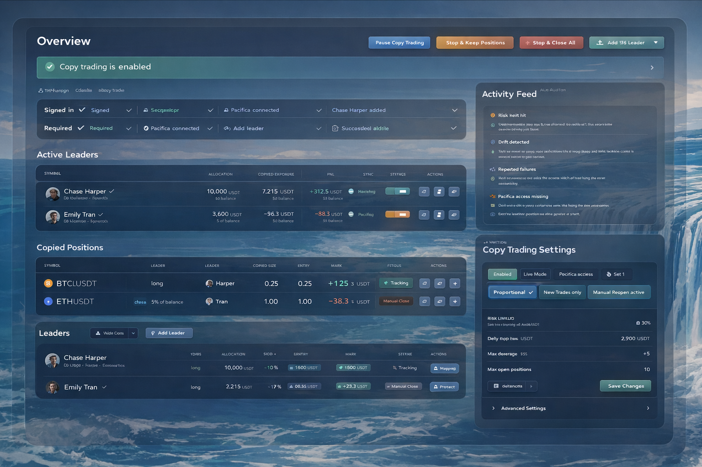
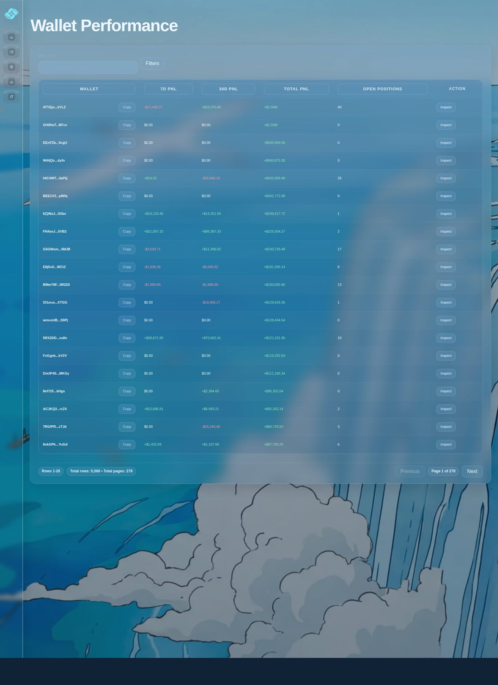

# PacificaFlow

<p align="center">
  
</p>

<p align="center">
  Pacifica-native analytics, wallet intelligence, copy trading, and workflow control.
</p>

<p align="center">
  <strong>Live data.</strong> <strong>Operational UI.</strong> <strong>Private-by-default runtime.</strong>
</p>

## What it does

- Wallet explorer and wallet performance
- Live positions, funding, and alerting
- Copy trading and execution controls
- Telegram copilot for wallet tracking

## Visual preview

| Copy Trading | Wallet Performance |
|---|---|
|  |  |

## Run

```bash
npm install
npm start
```

Open:

```bash
http://localhost:3200
```

## Services

- `pacifica-ui-api.service` for the UI/API shell
- `pacifica-wallet-indexer.service` for wallet history
- `pacifica-live-positions@.service` for live wallet-first shards
- `pacifica-global-kpi.service` for exchange-wide metrics
- `pacifica-telegram-copilot-bot.service` for Telegram wallet tracking

## Configuration

Use `config/runtime.example.env` as the template.

- Copy it to `config/runtime.env`
- Keep `config/runtime.env` local and out of git
- Store API keys, bot tokens, and secrets only in local runtime files or deployment env vars

## Public release notes

The repository is safe to publish as long as local runtime files stay untracked.
